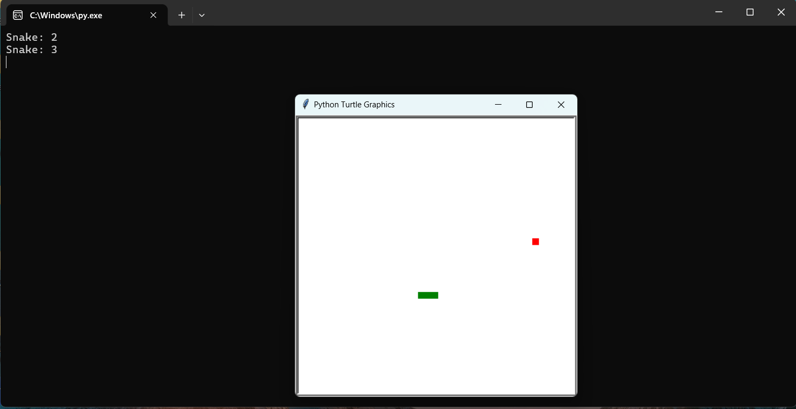

# 🐍 Snake and Apple Game 🍎

Welcome to the Snake and Apple Game, a classic arcade game implemented in Python using the Pygame library. Guide the snake to eat apples and grow, but be careful not to run into the walls or the snake's own body!




## 🎮 Features

- **Simple Controls:** Use the arrow keys to navigate the snake.
- **Classic Gameplay:** Eat apples to grow longer and avoid obstacles.
- **Score Tracking:** Keep track of your score as you play.
- **Endless Fun:** The game gets progressively challenging as the snake grows.

## 📋 Requirements

- Python 3.12.3
- Pygame library

## ⚙️ Installation

1. **Clone the repository:**
    ```bash
    git clone https://github.com/yourusername/snake-apple-game.git
    ```
2. **Navigate to the project directory:**
    ```bash
    cd snake-apple-game
    ```
3. **Install the Pygame library:**
    ```bash
    pip install pygame
    ```

## ▶️ How to Play

1. **Run the game:**
    ```bash
    python main.py
    ```
2. **Controls:**
    - Use the arrow keys to move the snake up, down, left, and right.
3. **Objective:**
    - Guide the snake to eat the apples.
    - Avoid hitting the walls or the snake's own body.
4. **Scoring:**
    - Each apple eaten increases your score and the snake's length.
## 🤝 Contributing

Contributions are welcome! If you have suggestions for improvements, feel free to:
- Fork the repository
- Create a new branch (`git checkout -b feature/AmazingFeature`)
- Commit your changes (`git commit -m 'Add some AmazingFeature'`)
- Push to the branch (`git push origin feature/AmazingFeature`)
- Open a Pull Request

For major changes, please open an issue first to discuss what you would like to change.

## 📧 Contact

If you have any questions or feedback, feel free to reach out to me via [GitHub Issues](https://github.com/yourusername/snake-apple-game/issues).

---

Enjoy playing the Snake and Apple Game! 🎉
